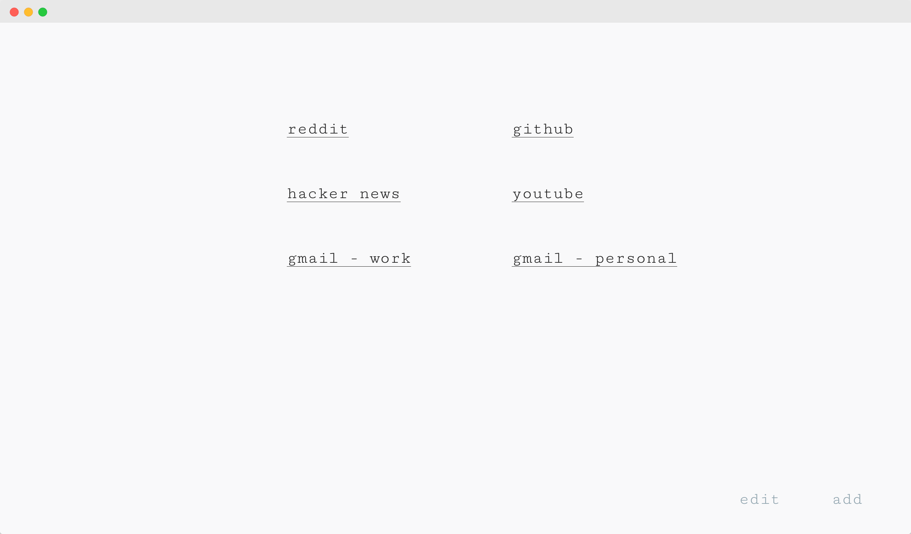

# Simpl

Just a minimal new tab extension for firefox showcasing your favorite websites.

[Grab it for firefox from here.](https://addons.mozilla.org/en-US/firefox/addon/simpl-new-tab/)



## Usage

Follow these steps to run the extension locally:

```
// Install the node modules.
npm install

// Transpile and bundle react code using babel and webpack so that is can run without
// the need of dev server.
npm run build

// Run the extension in firefox. It will spawn a new firefox instance. Just open a
// new tab in firefox to check it out :)
npm start
```

To bundle the extension for release, use this script:

```
// Create a release zip file for extension in 'web-ext-artifacts' directory.
npm run release
```

To run tests, just run `npm test`

## License

```
MIT License
-----------

Copyright (c) 2019 Kartik Sharma (http://crazyhitty.com/)
Permission is hereby granted, free of charge, to any person
obtaining a copy of this software and associated documentation
files (the "Software"), to deal in the Software without
restriction, including without limitation the rights to use,
copy, modify, merge, publish, distribute, sublicense, and/or sell
copies of the Software, and to permit persons to whom the
Software is furnished to do so, subject to the following
conditions:

The above copyright notice and this permission notice shall be
included in all copies or substantial portions of the Software.

THE SOFTWARE IS PROVIDED "AS IS", WITHOUT WARRANTY OF ANY KIND,
EXPRESS OR IMPLIED, INCLUDING BUT NOT LIMITED TO THE WARRANTIES
OF MERCHANTABILITY, FITNESS FOR A PARTICULAR PURPOSE AND
NONINFRINGEMENT. IN NO EVENT SHALL THE AUTHORS OR COPYRIGHT
HOLDERS BE LIABLE FOR ANY CLAIM, DAMAGES OR OTHER LIABILITY,
WHETHER IN AN ACTION OF CONTRACT, TORT OR OTHERWISE, ARISING
FROM, OUT OF OR IN CONNECTION WITH THE SOFTWARE OR THE USE OR
OTHER DEALINGS IN THE SOFTWARE.
```